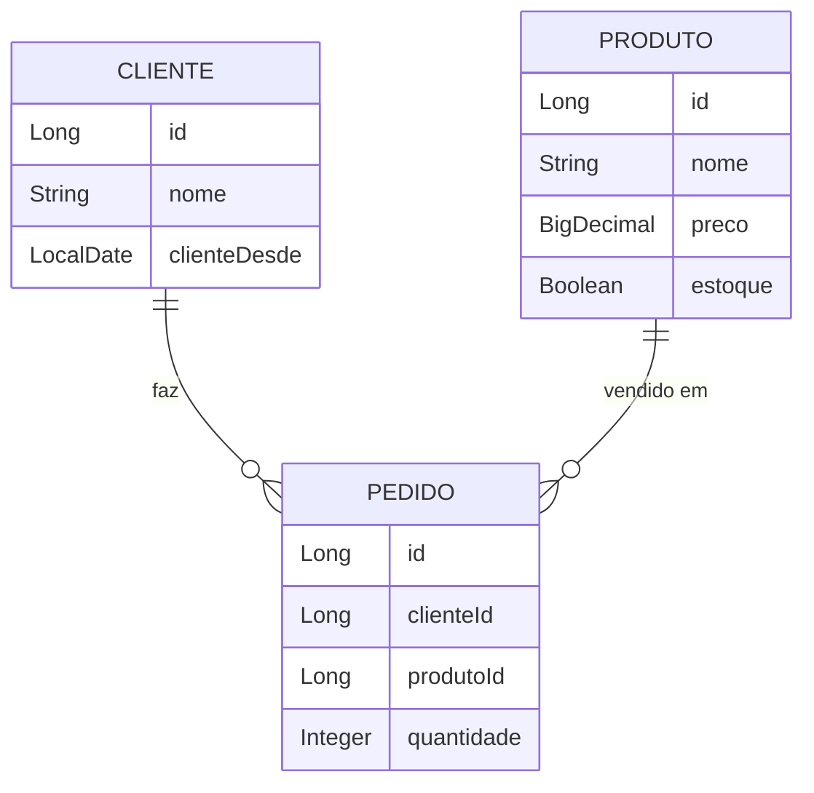

# 🥟 Baozi Store API

API REST da **Baozi Store**, uma pequena loja de pãozinho chinês, para controle básico de **clientes**, **produtos** e **pedidos**.


## Sumário

- [Tecnologias](#tecnologias)
- [Funcionalidades](#funcionalidades)
- [Modelo de dados](#modelo-de-dados)
- [Arquitetura](#arquitetura)
- [Como executar](#como-executar)
- [Endpoints](#endpoints)
- [Exemplos de uso](#exemplos-de-uso)
- [Regras de negócio e códigos de resposta](#regras-de-negócio-e-códigos-de-resposta)
- [Testes com Postman](#testes-com-postman)
- [Autora](#autora)

## Tecnologias

| Tecnologia | Uso |
|---|---|
| Java 25 | Linguagem (compatível com Java 17+; ajuste `java.version` no `pom.xml`) |
| Spring Boot 3.5.9 | Framework da aplicação |
| Spring Web (MVC) | Controllers REST com JSON |
| Spring Data JPA / Hibernate | Persistência e mapeamento objeto-relacional |
| Bean Validation | Validação dos dados de entrada |
| H2 (padrão) / MySQL (opcional) | Banco de dados relacional |
| Maven | Gerenciamento de dependências |
| Postman | Testes dos endpoints |

## Funcionalidades

- Cadastrar, listar, consultar por ID, atualizar e apagar **clientes**
- Cadastrar, listar, consultar por ID, atualizar e apagar **produtos**
- Registrar pedidos simples, em que **um cliente compra um único produto em determinada quantidade**
- Validação de dados e respostas de erro em JSON

## Modelo de dados



| Entidade | Campo | Tipo | Observação |
|---|---|---|---|
| **Cliente** | id | Long | Chave primária, gerada automaticamente |
| | nome | String | Obrigatório |
| | clienteDesde | LocalDate | Se não informado, assume a data atual |
| **Produto** | id | Long | Chave primária, gerada automaticamente |
| | nome | String | Obrigatório |
| | preco | BigDecimal | Obrigatório, maior que zero |
| | estoque | Boolean | `true` = em estoque |
| **Pedido** | id | Long | Chave primária, gerada automaticamente |
| | clienteId | Long (FK) | Referencia `Cliente` |
| | produtoId | Long (FK) | Referencia `Produto` |
| | quantidade | Integer | Mínimo 1 |

## Arquitetura

Padrão **MVC** do Spring, organizado em pacotes:

```
src/main/java/br/com/baozistore
├── BaoziStoreApplication.java
├── model/        → entidades JPA (Cliente, Produto, Pedido)
├── repository/   → interfaces Spring Data JPA
├── controller/   → endpoints REST e tratamento de erros de validação
└── dto/          → PedidoRequest (clienteId, produtoId, quantidade)
```

## Como executar

### Pré-requisitos

- JDK 25 (ou 17+, ajustando `java.version` no `pom.xml`)
- Maven 3.9+ (ou o Maven embutido na sua IDE)
- MySQL 8+ *(somente se for usar o perfil opcional `mysql`)*

### Pela linha de comando

Clone o repositório, entre na pasta `baozi-store-api` e execute:

```bash
mvn spring-boot:run
```

### Pelo Eclipse

1. **File → Import → Maven → Existing Maven Projects** e selecione a pasta do projeto.
2. Clique com o botão direito em `BaoziStoreApplication.java` → **Run As → Java Application**.

Quando o console mostrar `Started BaoziStoreApplication`, a API estará em **http://localhost:8080**.

### Banco de dados

O projeto funciona com **H2** por padrão e aceita **MySQL** como opção, selecionada por perfil do Spring.

**H2 (padrão)** — não precisa instalar nada. Os dados ficam em `data/baozidb` e persistem entre execuções.
Console web: http://localhost:8080/h2-console

| Campo | Valor |
|---|---|
| JDBC URL | `jdbc:h2:file:./data/baozidb` |
| User Name | `sa` |
| Password | *(vazio)* |

**MySQL (opcional)**

1. Crie o schema no MySQL:

   ```sql
   CREATE DATABASE baozi_store;
   ```

2. Ajuste usuário e senha em `src/main/resources/application-mysql.properties`.
3. Execute com o perfil `mysql`:

   - **Linha de comando:**

     ```bash
     mvn spring-boot:run -Dspring-boot.run.profiles=mysql
     ```

   - **Eclipse:** em **Run → Run Configurations...**, selecione `BaoziStoreApplication`, abra a aba **Arguments** e, em **VM arguments**, informe:

     ```
     -Dspring.profiles.active=mysql
     ```

As tabelas `cliente`, `produto` e `pedido` são criadas automaticamente pelo Hibernate nos dois bancos.

## Endpoints

Base URL: `http://localhost:8080`

| Método | Rota | Descrição | Sucesso | Erros |
|---|---|---|---|---|
| POST | `/clientes` | Criar cliente | 201 | 400 |
| GET | `/clientes` | Listar todos | 200 | — |
| GET | `/clientes/{id}` | Consultar por ID | 200 | 404 |
| PUT | `/clientes/{id}` | Atualizar *(opcional)* | 200 | 400, 404 |
| DELETE | `/clientes/{id}` | Apagar | 204 | 404, 409 |
| POST | `/produtos` | Criar produto | 201 | 400 |
| GET | `/produtos` | Listar todos | 200 | — |
| GET | `/produtos/{id}` | Consultar por ID | 200 | 404 |
| PUT | `/produtos/{id}` | Atualizar *(opcional)* | 200 | 400, 404 |
| DELETE | `/produtos/{id}` | Apagar | 204 | 404, 409 |
| POST | `/pedidos` | Criar pedido | 201 | 400, 404 |
| GET | `/pedidos` | Listar todos | 200 | — |
| GET | `/pedidos/{id}` | Consultar por ID | 200 | 404 |
| PUT | `/pedidos/{id}` | Atualizar *(opcional)* | 200 | 400, 404 |
| DELETE | `/pedidos/{id}` | Apagar | 204 | 404 |

## Exemplos de uso

Todas as requisições usam o header `Content-Type: application/json`.

**Criar cliente** — `POST /clientes`

```json
{
  "nome": "Iana123456",
  "clienteDesde": "2026-10-05"
}
```

**Criar produto** — `POST /produtos`

```json
{
  "nome": "Baozi de Carne",
  "preco": 6.50,
  "estoque": true
}
```

**Criar pedido** — `POST /pedidos`

```json
{
  "clienteId": 1,
  "produtoId": 1,
  "quantidade": 12
}
```

Resposta (`201 Created`): o pedido volta com o cliente e o produto completos.

```json
{
  "id": 1,
  "cliente": { "id": 1, "nome": "Iana123456", "clienteDesde": "2026-10-05" },
  "produto": { "id": 1, "nome": "Baozi de Carne", "preco": 6.50, "estoque": true },
  "quantidade": 12
}
```

**Exemplo com cURL**

```bash
curl -X POST http://localhost:8080/produtos \
  -H "Content-Type: application/json" \
  -d '{"nome":"Baozi de Carne","preco":6.50,"estoque":true}'
```

## Regras de negócio e códigos de resposta

| Código | Quando acontece |
|---|---|
| **201** | Registro criado |
| **200** | Consulta ou atualização realizada |
| **204** | Registro apagado |
| **400** | Dados inválidos (nome vazio, preço ≤ 0, quantidade < 1) ou produto **sem estoque** ao criar pedido |
| **404** | Cliente, produto ou pedido não encontrado |
| **409** | Tentativa de apagar cliente ou produto que já possui pedido |

Para apagar um cliente ou produto que já foi usado, apague antes os pedidos relacionados.

## Testes com Postman

Roteiro de testes, com o banco vazio (os ids começam em 1):

1. `POST /clientes`, `POST /produtos` e `POST /pedidos`
2. `GET /clientes`, `GET /produtos` e `GET /pedidos`
3. `GET /clientes/1`, `GET /produtos/1` e `GET /pedidos/1`
4. Criar um segundo cliente, produto e pedido (id 2) e apagar com `DELETE /pedidos/2`, `DELETE /clientes/2` e `DELETE /produtos/2`, nessa ordem

## Autora

**Iana Rodrigues**
